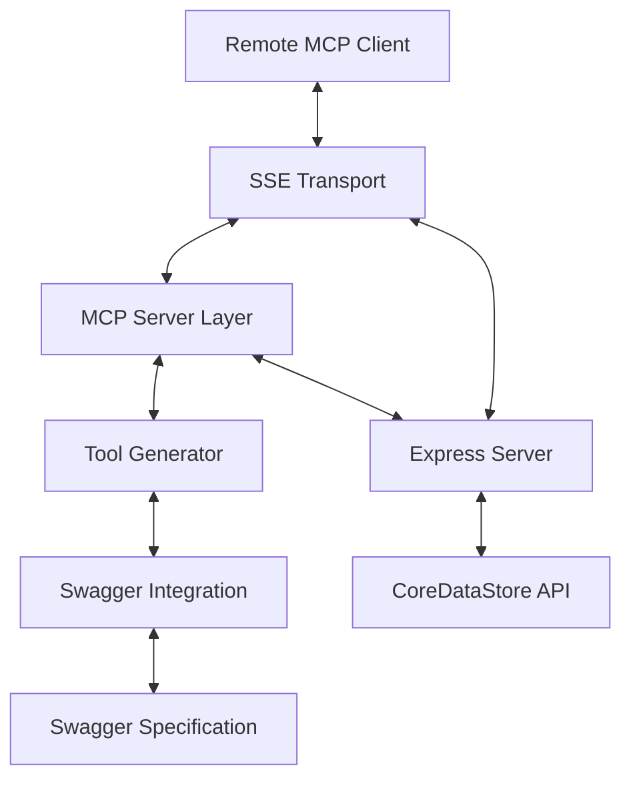

# CoreDataStore Swagger MCP Server - System Patterns

## System Architecture

The CoreDataStore Swagger MCP server follows a modular architecture with the following components:

## Key Components

### 1. MCP Server
- Implements the Model Context Protocol standard
- Handles tool listing and tool execution requests
- Uses the `@modelcontextprotocol/sdk` package
- Communicates with clients via SSEServerTransport
- Maintains session management for remote clients
- Maintains metadata about available tools

### 2. Express Server
- Provides HTTP endpoints for health checks and API proxying
- Handles direct API requests outside of the MCP protocol
- Serves as a development and testing interface
- Includes middleware for request/response handling

### 3. Swagger Integration
- Fetches the Swagger/OpenAPI specification from CoreDataStore API
- Parses the specification to understand available endpoints
- Maps endpoint details (paths, methods, parameters) to internal structures
- Creates the foundation for dynamic tool generation

### 4. Tool Generator
- Dynamically generates MCP tools based on Swagger endpoints
- Maps API paths to tool names
- Converts Swagger parameters to MCP tool input schemas
- Preserves metadata about each endpoint's requirements
- Handles translation between MCP tool calls and API requests

## Design Patterns

### 1. Adapter Pattern
- Adapts the CoreDataStore API to the MCP protocol
- Converts Swagger specification to MCP tool definitions
- Transforms MCP tool calls to API requests

### 2. Proxy Pattern
- Express server acts as a proxy for the CoreDataStore API
- Forwards requests and returns responses
- Handles error cases and formats responses appropriately

### 3. Factory Pattern
- Dynamically creates tools based on API specification
- Generates input schemas for each tool
- Constructs tool metadata and descriptions

### 4. Singleton Pattern
- Server instances are created once and shared
- Configuration is loaded at startup and maintained

## Data Flow

1. At startup:
   - Fetch Swagger specification
   - Parse and convert to tool definitions
   - Initialize Express server
   - Initialize MCP server

2. For MCP tool execution:
   - Client sends tool execution request
   - Server finds matching tool
   - Parameters are validated and processed
   - API request is constructed and sent
   - Response is formatted and returned

3. For direct API access:
   - HTTP request to Express server
   - Request is proxied to CoreDataStore API
   - Response is formatted and returned

## Error Handling

- API errors are caught and formatted as tool execution errors
- Express middleware handles HTTP-level errors
- Swagger parsing errors terminate initialization
- Tool execution errors are reported back to the client

## Configuration Management

- Environment variables control server behavior
- Key configurations include:
  - `SWAGGER_URL`: Location of the Swagger specification
  - `API_BASE_URL`: Base URL for CoreDataStore API requests
  - `PORT`: Express server port
